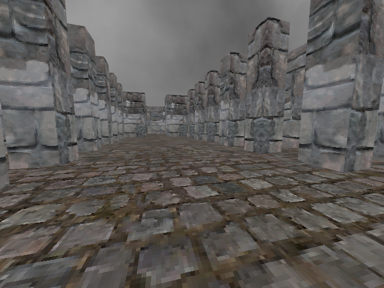

# Boomer Shooter

This is a project that I'm working on to prove that I know C++.
It's intended to be a boomer shooter in the end, but currently
there's not much to see.

## Compiling

### Linux

Requirements:
- `clang++` (compilation only tested on clang 18.1.3)

Method:
1. Run `build.sh`. A debug executable will be built called `game`.

### Windows

Windows is not currently supported. If you would like to try compiling
on Windows, you will need a static GLFW 3 library to link against.
Everything else should be included in this repo.

## Roadmap

I'm not sure if I plan to finish this project, but if I do, here's
some things I'd like to add in no particular order:
- Physics/collisions.
- Actual shooter mechanics. (weapons, enemies, etc.)
- A UI system.

## License

This project is licensed under the [MIT License](LICENSE), except where
otherwise specified.
